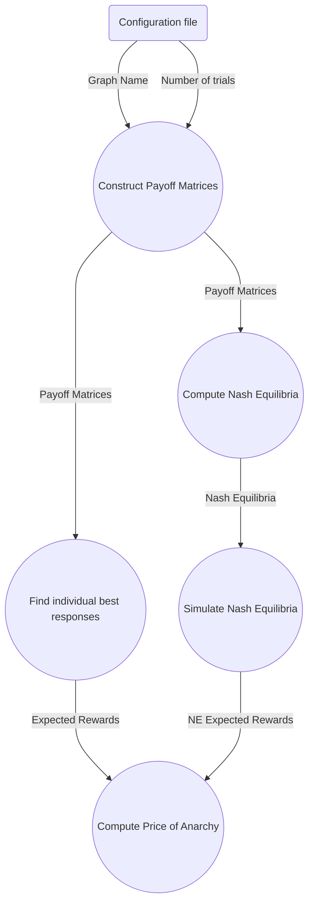

```mermaid
flowchart TD
    config@{shape: rounded, label: Configuration file}-- "Graph Name" ---> payoff((Construct Payoff Matrices))
    config--"Number of trials"--->payoff
    payoff--"Payoff Matrices"--->responses((Find individual best responses))
    responses--"Expected Rewards"--->poa
    payoff--"Payoff Matrices"--->nashpy((Compute Nash Equilibria))
    nashpy--"Nash Equilibria"--->simulate((Simulate Nash Equilibria))
    simulate--"NE Expected Rewards"--->poa((Compute Price of Anarchy))
```