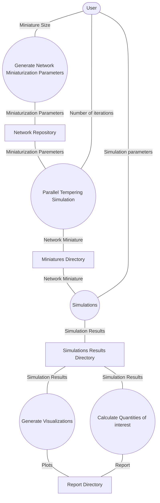

```mermaid
flowchart TD;
    %% Processes
    proc:params((Generate Network Miniaturization Parameters))
    proc:pt((Parallel Tempering Simulation))
    proc:simulations((Simulations))
    proc:viz((Generate Visualizations))
    proc:qois((Calculate Quantities of interest))

    %% Data Stores
    ds:net_repo[Network Repository]
    ds:dir_min[Miniatures Directory]
    ds:dir_sims[Simulations Results Directory]
    ds:dir_report[Report Directory]
    %% Entities

    %% Entities
    ent:user([User])

    %%  Wiring
    proc:params-- Miniaturization Parameters ---ds:net_repo
    ds:net_repo-- Miniaturization Paremeters ---proc:pt
    proc:pt-- Network Miniature ---ds:dir_min
    ds:dir_min-- Network Miniature ---proc:simulations
    proc:simulations-- Simulation Results ---ds:dir_sims

    ds:dir_sims-- Simulation Results ---proc:viz
    ds:dir_sims-- Simulation Results ---proc:qois

    proc:viz-- Plots ---ds:dir_report
    proc:qois-- Report ---ds:dir_report

    ent:user-- Miniature Size ---proc:params
    ent:user-- Number of iterations ---proc:pt
    ent:user-- Simulation parameters ---proc:simulations
```