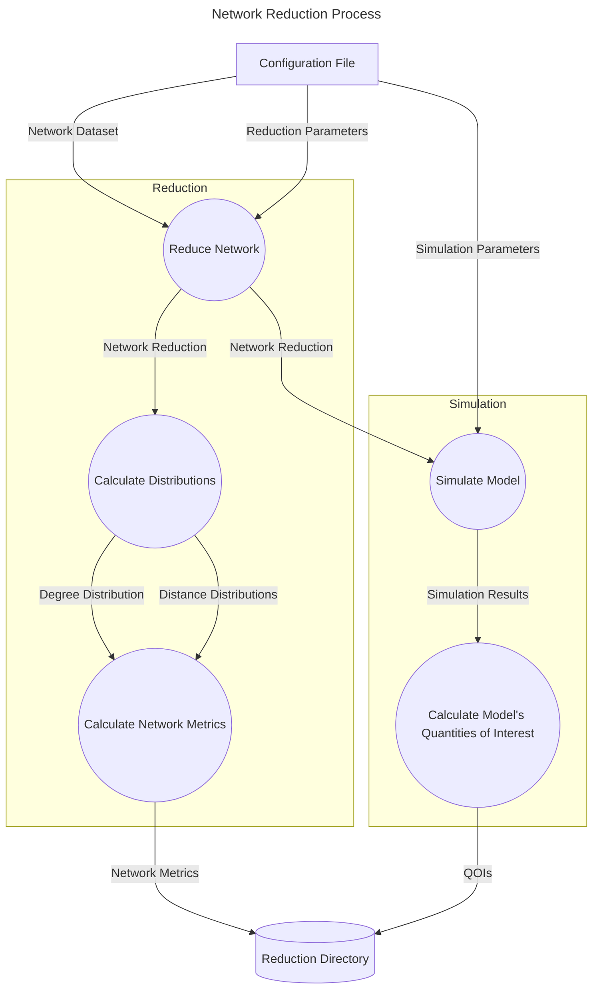

# Proyect Layout

## Network Reduction
The workflow allows for the generation of reduced network datasets according to different graph reduction techniques (GRTs).

We are interested in assesing the quality of a network reduction based on its properties and suitability for diffusion-based models. In addition to calculating the relevant network metrics of the newly obtain dataset, our workflow also simulates the SIR model on it and calculates a set of commonly used quantities of interested that can be used to asses the quality of the reduced dataset.

