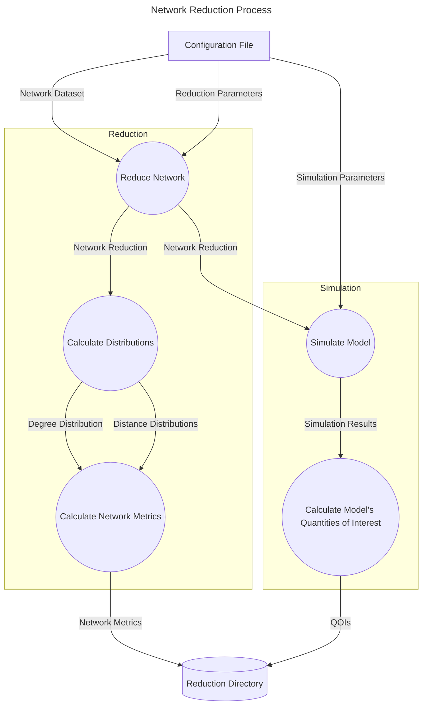

# Project Overview
Networks are often used to simulate important real-world phenomena such as infectious diseases, social influence, and the spread of misinformation.

Although real-world network datasets are readily available, simulating diffusion based models on them may be computationally unfeassible due to the large of the networks in them. In this project, we examine how different graph reduction techniques perform when the at downscaling large graphs while preserving properties that are relevant for diffusion. More specifically, we study the performance of graph **sparsification** and **coarsening** techniques. 

In addition to calculating the relevant network metrics of a newly obtain dataset, our workflow 
 simulates the SIR model on it and calculates a set of commonly used quantities of interested that can be used to further assess the quality of the reduced dataset.

## Project Structure
The two main components of this project are:

1. The *minigraphs* python library containing the implementation of various GRTs used in the workflow.
2. The workflow that will take a network dataset, reduce it, and the corresponding graph metrics and quantities of interest from the SIR model.

The *minigraphs* library and workflow can be found in the `src` and `workflows` directory, respectively, according to the following structure:

```
src/
    minigraphs/
workflows/
    config/
    data/
    envs/
    notebooks/
    scripts/
    slurm/
```
## Workflow Description
The workflow allows for the generation of reduced network datasets according to different graph reduction techniques.

The configuration file `workflows/config/config.yaml` allows the user to specify the parameters for each reduction technique as well as the simulation parameters for the SIR model. Many GRTs are based on randomized algorithms, so an ensemble of graphs for a set of parameters may be necessary to obtain reasonable confidence intervals on the algorithms performance. The total number of graphs generated for each technique can also be specified in this configuration file.

The following DFD highlights the major tasks executed by the workflow for each graph reduction generated:



## Workflow Execution
Various pre-defined conda environments are provided in the `workflows/envs` directory. The current version of the workflow can be executed in its entirety with the environment defined by `env.yaml` within this directory.

The `all` rule defined in the `Snakefile` will calculate the following for each graph reduction of the `hamsterster/giant` dataset:

- Graph Adjacency Matrix
- Dataset Network Metrics
- Network Property Distribution Metrics
- Sir Quantities of Interest


